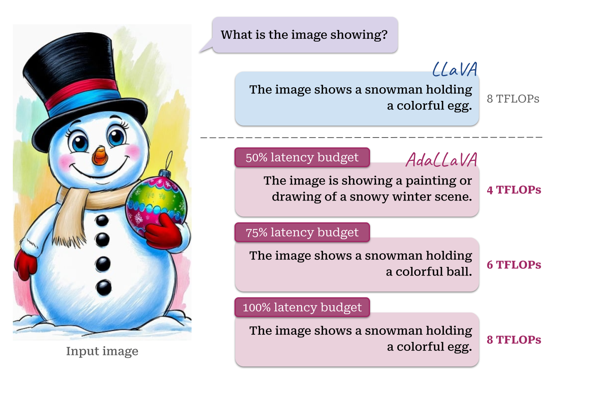

# AdaLLaVA: Learning to Inference Adaptively for Multimodal Large Language Models

<!-- > **This is a draft version of our official code repo, will move to [here](https://github.com/zhuoyan-xu/AdaLLaVA) in the end.** -->

*Learning to Inference Adaptively for Multimodal Large Language Models*

[Zhuoyan Xu*](https://pages.cs.wisc.edu/~zxu444/home/), [Khoi Duc Nguyen*](https://khoiucd.github.io/), Preeti Mukherjee, [Saurabh Bagchi ](https://www.saurabhbagchi.us/), [Somali Chaterji](https://schaterji.io/), [Yingyu Liang](https://pages.cs.wisc.edu/~yliang/), [Yin Li](https://www.biostat.wisc.edu/~yli/)

*Equal Contribution

[[Paper](https://arxiv.org/abs/2503.10905)] [[Project Page](https://zhuoyan-xu.github.io/ada-llava/)] [[Model Zoo](./docs/MODEL_ZOO.md)]




## Release
- [3/17/2025] 🔥 We released **AdaLLaVA** evaluation code. We intergrated popular tools [`lmms-eval`](https://github.com/EvolvingLMMs-Lab/lmms-eval) with [`LLM-viewer`](https://github.com/hahnyuan/LLM-Viewer) to evaluate on various benchmarks, while computing FLOPs, time, memory etc. during evaluation.
- [3/17/2025] 🔥 We released **AdaLLaVA**. We propose a dynamic inference approach for multimodal Large Language Models that operates efficiently under resource constraints.  Checkout our [paper](https://arxiv.org/abs/2503.10905).

[](https://github.com/tatsu-lab/stanford_alpaca/blob/main/LICENSE)
**Usage and License Notices**: This project utilizes certain datasets and checkpoints that are subject to their respective original licenses. Users must comply with all terms and conditions of these original licenses, including but not limited to the [OpenAI Terms of Use](https://openai.com/policies/terms-of-use) for the dataset and the specific licenses for base language models for checkpoints trained using the dataset (e.g. [Llama community license](https://ai.meta.com/llama/license/) for LLaMA-2 and Vicuna-v1.5). This project does not impose any additional constraints beyond those stipulated in the original licenses. Furthermore, users are reminded to ensure that their use of the dataset and checkpoints is in compliance with all applicable laws and regulations.


## Contents
- [Install Package](#install-package)
- [AdaLLaVA Weights](#adallava-weights)
- [Dataset](#dataset)
- [Evaluation](#evaluation)
- [Train](#train)


### Install Package
1. Clone this repository and navigate to the folder
```bash
git clone https://github.com/zhuoyan-xu/AdaLLaVA.git
cd AdaLLaVA
```

2. Create Environment
```Shell
conda create -n adallava python=3.10 -y
conda activate adallava
```

3. Install lmms_eval
```Shell
git clone https://github.com/EvolvingLMMs-Lab/lmms-eval
cd lmms-eval
git checkout 80391ce3bfb5a19b32e7a19a2d9399e1378ed2dd
pip install -e .
cd ..
```

4. Install LLaVa
```Shell
git clone https://github.com/haotian-liu/LLaVA.git
cd LLaVA
pip install --upgrade pip  # enable PEP 660 support
pip install -e .
pip install protobuf

pip install -e ".[train]"
pip install peft==0.13.2
pip install flash-attn==2.5.2 --no-build-isolation
cd ..
```

4. Install adallava
```Shell
pip install -e .
```

### Quick Start

```Python
from src.adallava.eval.run_ada_llava import eval_model

model_path = "zhuoyanxu/ada-llava-L-v1.5-7b"
prompt = "What are the things I should be cautious about when I visit here?"
image_file = "https://llava-vl.github.io/static/images/view.jpg"

args = type('Args', (), {
    "model_path": model_path,
    "model_name": 'ada_llava_llama',
    "query": prompt,
    "conv_mode": None,
    "image_file": image_file,
    "sep": ",",
    "temperature": 0,
    "top_p": None,
    "num_beams": 1,
    "max_new_tokens": 512,
    "latency": 1.0,
    "hardware": "nvidia_V100",
})()

eval_model(args)
```


## AdaLLaVA Weights
Please check out our [Model Zoo](docs/MODEL_ZOO.md) for all public AdaLLaVA checkpoints, and the instructions of how to use the weights.


## Dataset
We follow original LLaVA repository and use their *stage-2:Visual Instruction Tuning* [data](https://github.com/haotian-liu/LLaVA/blob/main/docs/Data.md). See details for prepare dataset in [Train](#train).

## Evaluation
In AdaLLaVA, we evaluate models on a existing benchmarks using official toolkit [`lmms-eval`](https://github.com/EvolvingLMMs-Lab/lmms-eval) to ensure the reproducibility. 
We integrate `lmms-eval` with [`LLM-viewer`](https://github.com/hahnyuan/LLM-Viewer) to compute the FLOPs and time during evaluation.

### Evaluation on various benchmarks
To evaluate Ada-LLaVa on difference latency constraints, please change the `latency` in the `model_args`. For example, to evaluate adallava with 85% latency constraint, run

```bash
python3 -m accelerate.commands.launch \
    -m adallava.eval.run_lmms_eval \
    --model adallava \
    --model_args pretrained=zhuoyanxu/ada-llava-L-v1.5-7b,latency=0.85 \
    --tasks mme,pope,mmbench_en_dev,scienceqa_img,textvqa_val \
    --batch_size 1 \
    --log_samples \
    --log_samples_suffix adallava_0.85 \
    --output_path ./logs_0.85/
```

For textvqa_val, please set the [OCR incorporation](https://github.com/EvolvingLMMs-Lab/lmms-eval/blob/80391ce3bfb5a19b32e7a19a2d9399e1378ed2dd/lmms_eval/tasks/textvqa/_default_template_textvqa_yaml#L14) to True. 

The result file contains the evaluation metric score on each benchmark, along with the evaluation time, FLOPs and memory. Example output of `MME`:
```json
"mme": {
      "alias": "mme",
      "flops,flops": 7239070670529.51,
      "flops_stderr,flops": "N/A",
      "avg_flops,avg_flops": 3615471530841.294,
      "avg_flops_stderr,avg_flops": "N/A",
      "prefill_flops,prefill_flops": 7227678532923.026,
      "prefill_flops_stderr,prefill_flops": "N/A",
      "prefill_time,prefill_time": 0.06871909813745529,
      "prefill_time_stderr,prefill_time": "N/A",
      "memory_consumption,memory_consumption": 22598248812.697556,
      "memory_consumption_stderr,memory_consumption": "N/A",
      "prefill_memory_consumption,prefill_memory_consumption": 11342271151.824768,
      "prefill_memory_consumption_stderr,prefill_memory_consumption": "N/A",
      "mme_cognition_score,none": 324.6428571428571,
      "mme_cognition_score_stderr,none": "N/A",
      "mme_perception_score,none": 1487.19037615046,
      "mme_perception_score_stderr,none": "N/A"
    }
```

### Evaluation on benchmarks requiring submission
Certain benchmarks requires submitting results to official server, such as `VQAv2`. Here we provide steps for evaluating on VQAv2 testdev split, following the same setting as LLaVA.

```bash
python3 -m accelerate.commands.launch \
    -m adallava.eval.run_lmms_eval \
    --model adallava \
    --model_args pretrained=zhuoyanxu/ada-llava-L-v1.5-7b,latency=0.85 \
    --tasks vqav2_test \
    --batch_size 1 \
    --log_samples \
    --log_samples_suffix adallava_0.85 \
    --output_path ./logs_0.85_vqav2/
``` 

For vqav2_test, please set the [test_split](https://github.com/EvolvingLMMs-Lab/lmms-eval/blob/80391ce3bfb5a19b32e7a19a2d9399e1378ed2dd/lmms_eval/tasks/vqav2/vqav2_test.yaml#L3) to testdev. After running lmms-eval, convert the submission file with
```
python scripts/convert/convert_lmms_vqav2.py --src $SRC --dst $DST
```
where `SRC` is the json file under `./logs_0.85_vqav2/submission/`, `DST` is the path of converted submission file.
Submit the converted submission file to [VQA Challenge 2021](https://eval.ai/web/challenges/challenge-page/830/overview).


### Evaluate using original LLaVA-1.5 evaluation script
See [`Evaluation_LLaVA.md`](docs/Evaluation_LLaVA.md)

## Train


### Prepare data
Follow instructions from [here](https://github.com/haotian-liu/LLaVA?tab=readme-ov-file#visual-instruction-tuning) to download images from these 5 datasets for LLaVA v1.5 fine-tuning. Put the zip files in the corresponding folders and unzip them. 
image path:
```bash
LLaVA-Finetune
├── images
│   ├── coco
│   │   └── train2017
│   ├── gqa
│   │   └── images
│   ├── ocr_vqa
│   │   └── images
│   ├── textvqa
│   │   └── train_images
│   └── vg
│       ├── VG_100K
│       └── VG_100K_2
└── llava_v1_5_mix665k.json
```
download instruction tuning data from [here](https://huggingface.co/datasets/liuhaotian/LLaVA-Instruct-150K/blob/main/llava_v1_5_mix665k.json) into `./LLaVA-Finetune/llava_v1_5_mix665k.json`.

### Joint training of model and scheduler
Our training directly follow original LLaVA repository *stage-2:Visual Instruction Tuning*.  We load pretrained checkpoint of llava 1.5 and random initilize weights for scheduler.


Training script with DeepSpeed ZeRO-3: [`train_script.sh`](./scripts/train_script.sh).  Set the ```model_name_or_path``` parameter to the path of your pre-trained llava checkpoints, such as ```liuhaotian/llava-v1.5-7b```. The trained AdaLLaVA model will be saved at the specified ```output_dir```.


## Citation

If you find **AdaLLaVA** useful for your research and applications, please cite using this BibTeX:
```bibtex
@article{zhuoyan2025adallava,
          title={Learning to Inference Adaptively for Multimodal Large Language Models},
          author={Xu, Zhuoyan and Nguyen, Khoi Duc and Mukherjee, Preeti and Bagchi, Saurab and Chaterji, Somali and Liang, Yingyu and Li, Yin},
          journal={arXiv preprint arXiv:2503.10905},
          year={2025}
        }

```


## Acknowledgement


- [LLaVA](https://github.com/haotian-liu/LLaVA): The codebase we built upon.

- [LLM-Viewer](https://github.com/hahnyuan/LLM-Viewer): The code we used for calculating FLOPs, prefill time, etc..

- [lmms-eval](https://github.com/EvolvingLMMs-Lab/lmms-eval): The code for evaluating multimodal LLMs.

